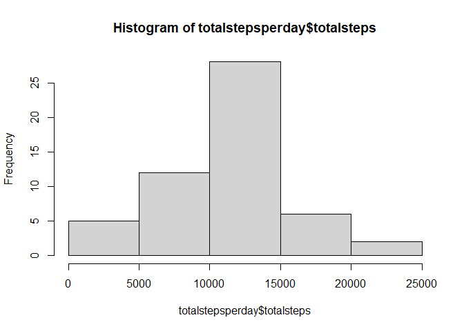
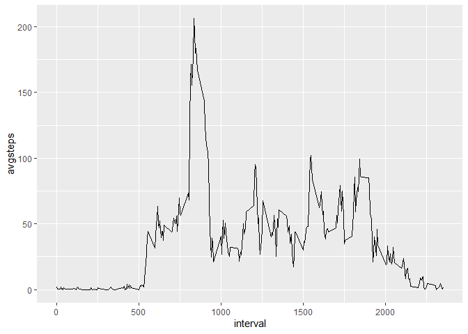
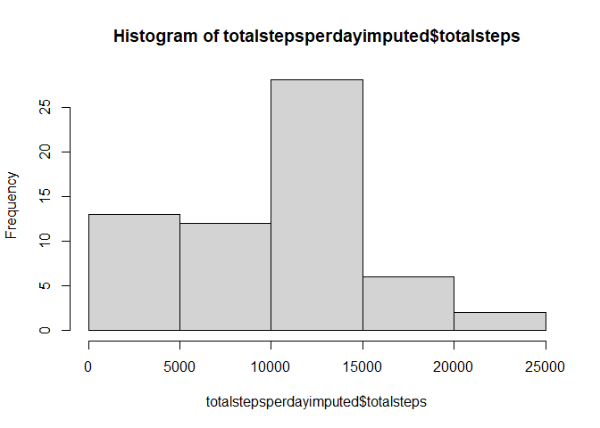
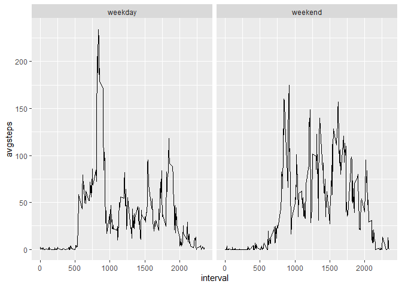

## Loading and preprocessing the data

First we load all the packages we're going to work with and unzip the `.zip` file which contains the `.csv` we're interested in.

Then we load the `.csv` file with the tidyverse command `read_csv()` to load it as a tibble in our workspace. Simultaneously we use `mutate()` and `ymd()` to change the date column from a character vector to an actual date.


```r
library(lubridate)
library(tidyverse)
library(ggplot2)

unzip("activity.zip")
activitydata <- read_csv("activity.csv") %>% mutate(date = ymd(date))
```

## What is mean total number of steps taken per day?

To plot the total steps per day we first group our data by date and then sum up all the steps of that day. Then we just need to call the `hist()` command on the sum of steps to get our plot.


```r
totalstepsperday <- activitydata %>% group_by(date) %>% summarise(totalsteps = sum(steps))
hist(totalstepsperday$totalsteps)
```

<!-- -->

To get the mean and median total steps per day we use `summary()` on the created vector of total steps per day.


```r
summary(totalstepsperday$totalsteps)
```

```
##    Min. 1st Qu.  Median    Mean 3rd Qu.    Max.    NA's 
##      41    8841   10765   10766   13294   21194       8
```

We can see the mean total steps are 10766 and the median total steps are 10765.

## What is the average daily activity pattern?

To look at the average daily activity pattern we first average the steps per interval and then plot them with a line plot.


```r
avgsteps <- activitydata %>% group_by(interval) %>% summarise(avgsteps = mean(steps, na.rm = TRUE))
ggplot(avgsteps, aes(x = interval, y = avgsteps))+
    geom_line()
```

<!-- -->

To see in which Interval the activity is highest, we can inspect the plot or extract the exact interval with the maximum average steps.


```r
avgsteps[which.max(avgsteps$avgsteps),"interval"][[1]]
```

```
## [1] 835
```
We can see the interval with the most steps on average in a day is 835.

## Imputing missing values

```r
sum(is.na(activitydata))
```

```
## [1] 2304
```
We can observe that there are 2304 missing values for the measured steps.

To impute these we replace the `NA`s with the median value of the respective interval. In my opinion the median makes more sense than the mean since when picking the mean you would introduce rational numbers which don't make sense for a step count. Also picking the median of the intervals made intuitively sense to me since I would expect the variance between intervals (times in the day), to be higher than between days.


```r
imputedactivitydata <- activitydata %>%
    group_by(interval) %>%
    mutate(steps = case_when(
        is.na(steps) ~ median(steps, na.rm = TRUE),
        !is.na(steps) ~ steps))
```


```r
totalstepsperdayimputed <- imputedactivitydata %>% 
    group_by(date) %>% 
    summarise(totalsteps = sum(steps))
hist(totalstepsperdayimputed$totalsteps)
```

<!-- -->

```r
summary(totalstepsperdayimputed$totalsteps)
```

```
##    Min. 1st Qu.  Median    Mean 3rd Qu.    Max. 
##      41    6778   10395    9504   12811   21194
```

The histogram with the imputed data looks quite different, especially during the early hours of the day.

We can also see that the new median of 10395 is not as sensitive to the changes in the data as the mean which dropped to 9504.

## Are there differences in activity patterns between weekdays and weekends?

To investigate the difference in activity between weekends and weekdays we first assign every observation if it is an observation from a weekday or the weekend. Then we can average the steps for each interval and compare weekdays to weekends in a lineplot again.


```r
weekdays <- c("Monday", "Tuesday", "Wednesday", "Thursday", "Friday")
weekends <- c("Saturday", "Sunday")
activitydata2 <- activitydata %>%
    mutate(daytype = case_when(
        weekdays(date) %in% weekdays ~ "weekday",
        weekdays(date) %in% weekends ~ "weekend",
    )) %>%
    group_by(interval, daytype) %>%
    summarise(avgsteps = mean(steps, na.rm = TRUE))

ggplot(activitydata2, aes(x = interval, y = avgsteps)) +
    facet_grid(~daytype) +
    geom_line()
```

<!-- -->

